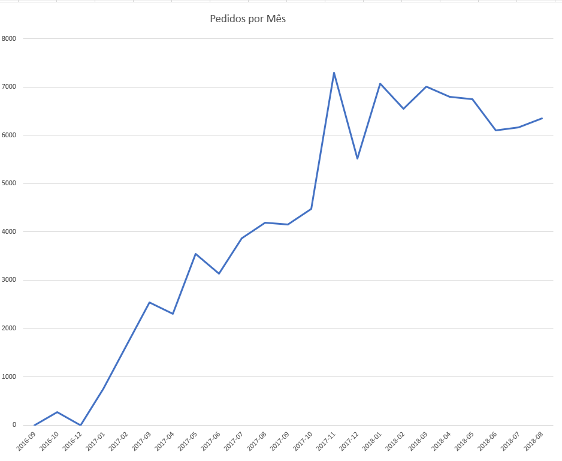

# 📊 Sales Analysis

## Objetivo

Analisar o desempenho de vendas do e-commerce Olist utilizando SQL para identificar tendências, padrões de crescimento e métricas importantes do negócio.

---

## Tecnologias Utilizadas

- SQL
- SQLite
- Excel
- Git/GitHub

---

## Perguntas Respondidas

### 1. Qual o faturamento total da empresa?

Calcula a receita total considerando o valor dos produtos e do frete dos pedidos entregues.

### 2. Qual o ticket médio por pedido?

Calcula o valor médio gasto por pedido entregue.

### 3. Quantos pedidos foram realizados por mês?

Analisa a evolução do volume de pedidos ao longo do tempo.

---

## Análise: Pedidos por Mês

### Insight

Os pedidos apresentaram crescimento consistente ao longo do período analisado, com forte pico em novembro de 2017, indicando impacto sazonal relacionado à Black Friday.

### Visualização



---

## Estrutura do Projeto

```text
01_sales_analysis/
│
├── README.md
├── queries.sql
└── screenshots/
    
```

