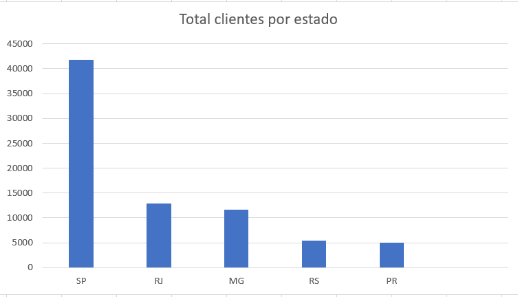
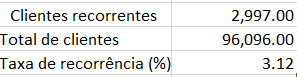
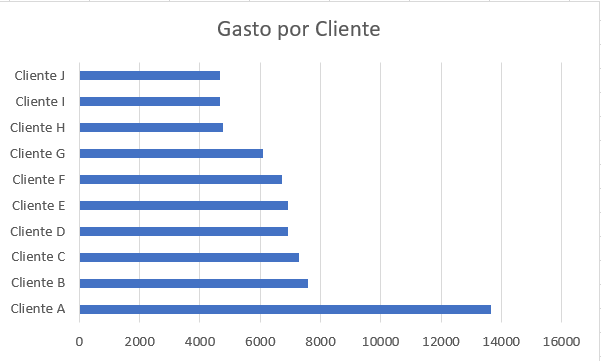

# 👥 Customer Behavior Analysis

## Objetivo

Analisar o comportamento dos clientes da plataforma Olist utilizando SQL para identificar padrões de distribuição geográfica, recorrência de compras e clientes de maior valor.

---

## Tecnologias Utilizadas

* SQL
* SQLite
* Excel
* Git/GitHub

---

## Perguntas Respondidas

### 1. Quais estados possuem mais clientes?

Identifica os estados com maior concentração de clientes cadastrados na plataforma.

### 2. Quantos clientes compraram mais de uma vez?

Avalia a recorrência de compras e a retenção de clientes.

### 3. Quais clientes mais gastaram?

Identifica os clientes responsáveis pelos maiores volumes de faturamento.

---

## Análise: Clientes por Estado

### Insight

São Paulo concentra a maior parte da base de clientes, apresentando um volume significativamente superior aos demais estados analisados.

### Visualização



---

## Análise: Clientes Recorrentes

### Resultado

| Métrica              |  Valor |
| -------------------- | -----: |
| Clientes recorrentes |  2.997 |
| Total de clientes    | 96.096 |
| Taxa de recorrência  |  3,12% |

### Insight

Apenas 3,12% dos clientes realizaram mais de uma compra durante o período analisado, indicando baixa recorrência de compras na plataforma.

### Visualização



---

## Análise: Top 10 Clientes por Gasto

### Insight

Os clientes de maior valor apresentaram gastos significativamente superiores à média da base. O principal cliente registrou gasto total de R$ 13.664,08, aproximadamente 80% acima do segundo colocado do ranking.

### Visualização



---

## Estrutura do Projeto

```text
02_customer_behavior/
│
├── README.md
├── queries.sql
└── screenshots/
    ├── clientes_por_estado.png
    ├── clientes_recorrentes.png
    └── top_clientes_gasto.png
```
