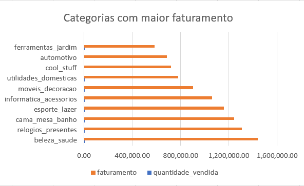
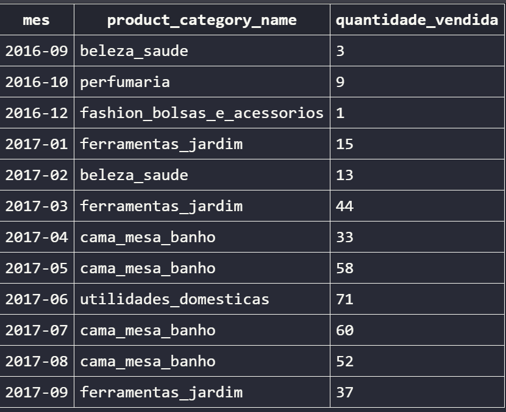
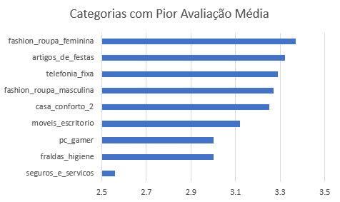

# Product Analysis

## Objetivo

Analisar o desempenho dos produtos da Olist sob a perspectiva de vendas e satisfação dos clientes, identificando categorias com maior relevância comercial e categorias que apresentam oportunidades de melhoria.

---

## Dataset

Base de dados: Olist E-commerce Dataset

Tabelas utilizadas:

- products
- order_items
- orders
- order_reviews

---

## Perguntas de Negócio

### 1. Quais categorias mais faturaram?

Objetivo:
Identificar as categorias que geram maior receita para a empresa.

Principais métricas:

- Quantidade vendida
- Faturamento total

Resultado:

As categorias de maior faturamento foram:

1. Beleza e Saúde
2. Relógios e Presentes
3. Cama, Mesa e Banho
4. Esporte e Lazer
5. Informática e Acessórios

Essas categorias representam uma parcela significativa da receita total da plataforma.

### Visualização

---

### 2. Quais produtos mais venderam por mês?

Objetivo:
Identificar os produtos líderes de vendas em cada período.

Técnicas utilizadas:

- CTEs
- Window Functions (RANK)
- Agrupamentos
- JOINs

Resultado:

Foi possível identificar mudanças de liderança ao longo do tempo, com destaque para categorias como:

- Ferramentas Jardim
- Cama Mesa Banho
- Relógios e Presentes
- Móveis e Decoração

Insight:

Algumas categorias permaneceram líderes por vários meses consecutivos, indicando forte demanda e estabilidade nas vendas.

### Visualização

Tabela de produtos líderes por mês disponível nos resultados da consulta SQL.

---

### 3. Quais categorias possuem pior avaliação média?

Objetivo:
Identificar categorias com menor nível de satisfação dos clientes.

Métrica utilizada:

- Média das avaliações (review_score)

Resultado:

As categorias com menor avaliação média foram:

- seguros_e_servicos
- fraldas_higiene
- pc_gamer
- moveis_escritorio
- casa_conforto_2

Insight:

Apesar de não apresentarem diferenças extremamente grandes entre si, essas categorias registraram os menores índices de satisfação da plataforma, indicando possíveis oportunidades de melhoria em qualidade, logística ou experiência do cliente.

### Visualização

---

## Ferramentas Utilizadas

- SQL
- SQLite
- Excel
- Git
- GitHub
- VS Code

---

## Principais Aprendizados

Durante este projeto foram aplicados conceitos importantes de análise de dados:

- JOINs entre múltiplas tabelas
- CTEs
- Funções de agregação
- Window Functions
- Criação de indicadores de negócio
- Construção de visualizações para apoio à tomada de decisão

---

## Conclusão

A análise revelou categorias responsáveis pela maior parte do faturamento da plataforma e também identificou segmentos que apresentam menor satisfação dos clientes. Esses insights podem auxiliar equipes de negócio na definição de estratégias de crescimento, melhoria da experiência do cliente e priorização de investimentos.