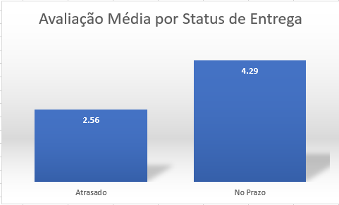

# Delivery Performance Analysis

## Objetivo

Analisar o desempenho logístico da operação da Olist, identificando padrões de entrega, atrasos e seus impactos na experiência dos clientes.

---

## 1. Prazo Médio de Entrega

### Pergunta de Negócio

Qual o prazo médio de entrega dos pedidos concluídos?

### Metodologia

Foi calculada a diferença entre a data de compra e a data de entrega para todos os pedidos com status **delivered**.

### Insight

O prazo médio de entrega fornece uma visão geral da eficiência logística da operação e serve como indicador de desempenho para comparações futuras.

---

## 2. Estados com Maior Atraso Médio

### Pergunta de Negócio

Quais estados apresentam os maiores atrasos nas entregas?

### Metodologia

Foi calculada a diferença entre a data de entrega real e a data estimada de entrega. Apenas pedidos efetivamente atrasados foram considerados.

### Visualização

### Principais Resultados

| Estado | Atraso Médio (dias) |
| ------ | ------------------: |
| AP     |               48.86 |
| RR     |               37.09 |
| AM     |               20.90 |
| AC     |               19.03 |
| SE     |               16.89 |

### Insight

Estados da região Norte apresentaram os maiores atrasos médios, sugerindo possíveis desafios logísticos relacionados à distância geográfica e infraestrutura de transporte.

---

## 3. Relação entre Atraso e Avaliação dos Clientes

### Pergunta de Negócio

Os atrasos impactam a satisfação dos clientes?

### Metodologia

Os pedidos foram classificados em dois grupos:

* **Atrasado**: entrega após a data estimada.
* **No Prazo**: entrega realizada dentro do prazo previsto.

Em seguida, foi calculada a nota média (`review_score`) de cada grupo.

### Visualização

### Resultados

| Status da Entrega | Nota Média |
| ----------------- | ---------: |
| Atrasado          |       2.56 |
| No Prazo          |       4.29 |

### Insight

Existe uma forte associação entre atrasos e avaliações negativas. Pedidos entregues no prazo receberam notas significativamente superiores aos pedidos atrasados.

---

## Conclusões Gerais

A análise revelou que a logística possui impacto direto na experiência do cliente. Além de apresentar diferenças regionais importantes nos tempos de entrega, os atrasos demonstraram influência significativa nas avaliações recebidas pelos pedidos.

Os resultados indicam que melhorias na eficiência logística podem contribuir para maior satisfação dos clientes e melhor percepção da plataforma.
